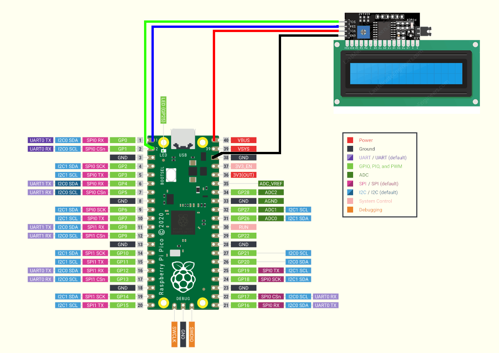
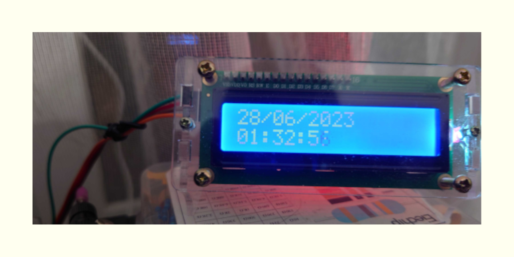
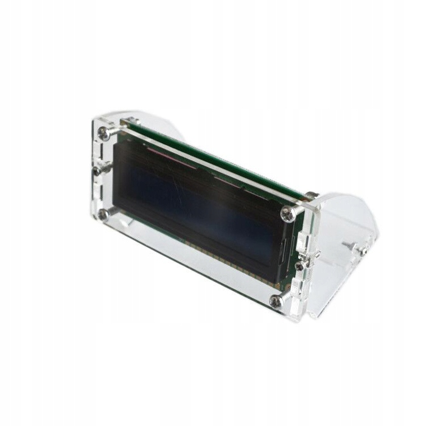
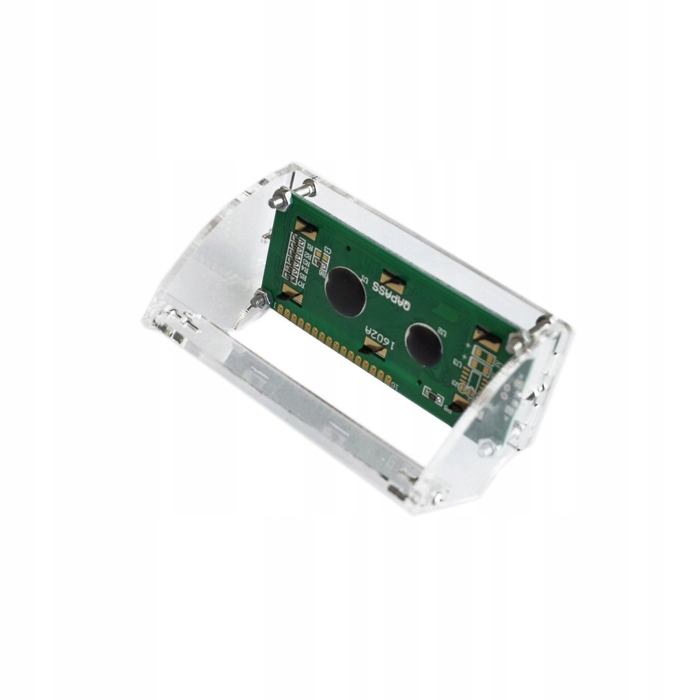
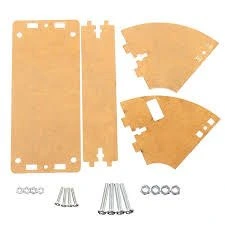

# PicoW_i2c_lcd1602_clock
The simple digital clock, built using Pico W, LCD 1602 with i2c interface

In order to make it work:

1. Software:
  * Download repo
  * Copy secrets_dist.py file to secrets.py file
  * Adjust data in secrets.py file
2. Hardware:
  * Connect LCD 1602 VCC to Pico VBUS pin
  * Connect LCD 1602 GND to any Pico GND pin (for example, 38th)
  * Connect LCD 1602 SDA to Pico GP0 pin
  * Connect LCD 1602 SCL to Pico GP1 pin
3. Connect altogether:
  * Thonny - install micropython;
  * Upload the files to Pico;
  * Reset and disconnect from PC;
  * Done!

Components list:
* Screen: HD44780
* I2C Controller: PCF8574T
* Raspberry Pi Pico W
* 4 cables with connectors male-female
* MicroUSB cable
* (optional) Screen holder

Scheme:

Working result:

Screen holder:

