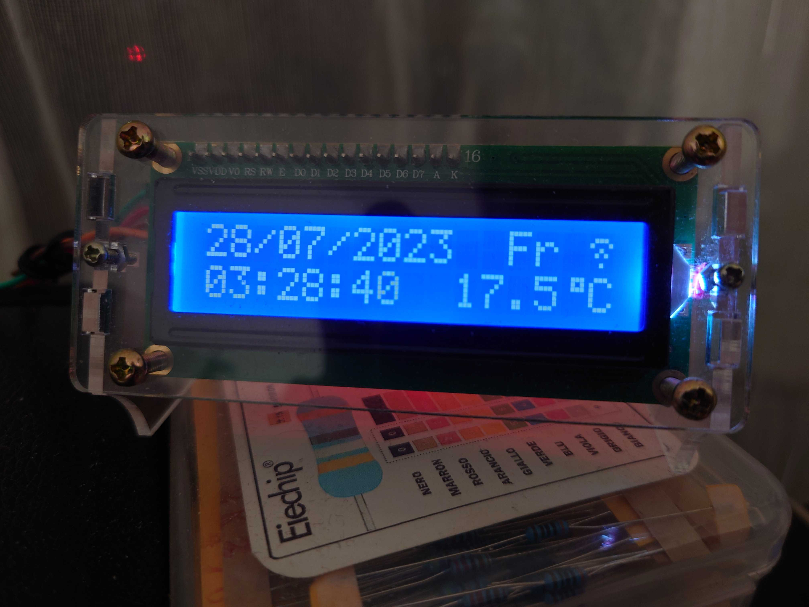

# PicoW_i2c_lcd1602_clock
The simple digital clock, which syncs with NTP server via WiFi.
Built using Pico W, LCD 1602 with i2c interface

In order to make it work:

1. Software:
  * Download repo
  * Copy secrets_dist.py file to secrets.py file
  * Adjust data in secrets.py file
2. Hardware:
  * Connect LCD 1602 VCC to Pico VBUS pin
  * Connect LCD 1602 GND to any Pico GND pin (for example, 38th)
  * Connect LCD 1602 SDA to Pico GP0 pin
  * Connect LCD 1602 SCL to Pico GP1 pin
3. Connect altogether:
  * Thonny - install micropython;
  * Upload the files to Pico;
  * Reset and disconnect from PC;
  * Done!

Components list:
* **Screen: HD44780**  _(screen and I2C can be bought for example [here](https://botland.store/alphanumeric-and-graphic-displays/2351-lcd-display-2x16-characters-blue-i2c-lcm1602-5904422309244.html) )_
* **I2C Controller: PCF8574T**
* **Raspberry Pi Pico W**  _(can be bought for example [here](https://botland.store/raspberry-pi-pico-modules-and-kits/21574-raspberry-pi-pico-w-rp2040-arm-cortex-m0-cyw43439-wifi-5056561803173.html) )_
* **4 cables with connectors male-female**  _(can be bought for example [here](https://botland.store/female-to-male-connecting-cables/19949-connecting-cables-female-male-justpi-10cm-40pcs-5904422328696.html) )_
* **MicroUSB cable**  _(can be bought for example [here](https://botland.store/usb-20-cables/2906-microusb-cable-b-a-1m-5901812014474.html) )_
* _(optional)_ **Screen holder**  _(can be bought for example [here](https://botland.store/alphanumeric-and-graphic-displays/10914-stand-for-lcd-display-2x16-characters-5904422317027.html) )_

Scheme:

Working result:

Screen holder:

